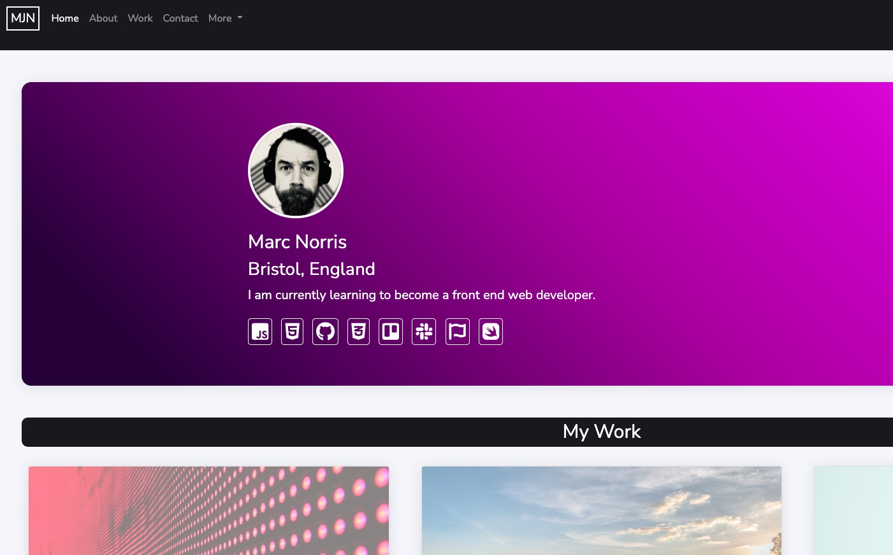
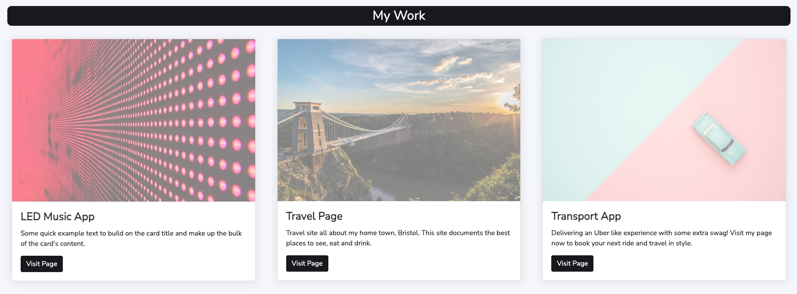
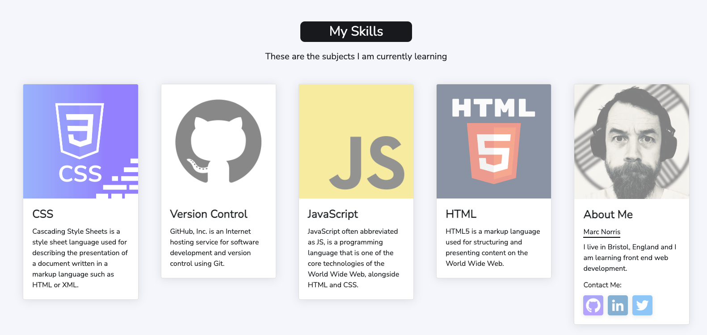
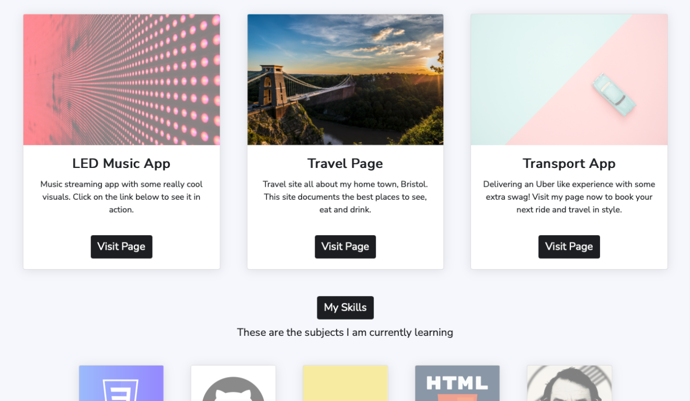

# Bootstrap Portfolio

## This is my Bootstrap portfolio.

 

### The Task:

* I have been tasked with creating a portfolio page using the Bootstrap CSS Framework.

 

**`Instructions:`**

Portfolio site must contain the following:

* A navigation bar
* A navigation menu at the top. Feel free to use Bootstrap's navbar or create your own.
* Include links that are applicable to your portfolio.
* Links should navigate to the appropriate sections
* A hero section
* A jumbotron featuring your picture, your name, and any other information you'd like to include.
* A work section
* A section displaying your work in grid.
* If you need to use placeholder image use placehold.co Links to an external site.
* Use Bootstrap cards for each project.
* The description should give a brief overview of the work.
Each project will eventually link to your class project work!
* A skills section
List out the skills you expect to learn from the bootcamp.
* An about/contact section
* An About Me section in the same row.
* A footer section
* All hyperlinks should have a hover effect.
* All buttons should display a box shadow upon hover.

 

## Installation

N/A

 

## Usage

Please click on the following link to see my finished portfolio page.

https://shaky411.github.io/Bootstrap-Portfolio/

 

## Screenshots

 

 

## Credits

N/A

 

## License

* _This application has the MIT Licence_
For more info, please go to the [licence description](https://opensource.org/license/mit/)
